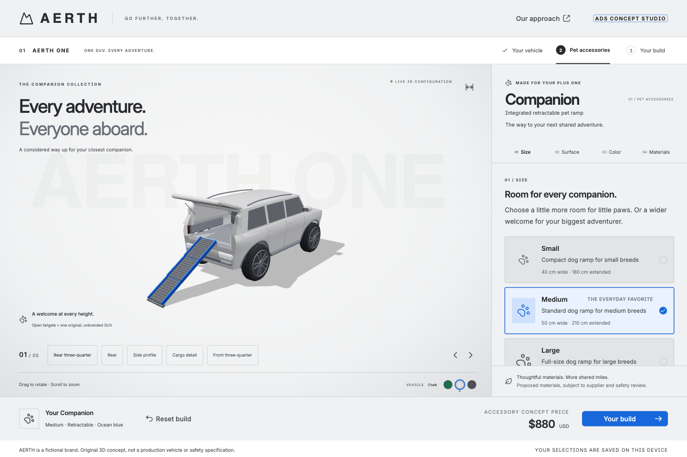

# AERTH Companion Configurator

**Every adventure. Everyone aboard.**

A self-contained automotive accessory configurator for the founder keynote prototype. One original, unbranded SUV, an open tailgate, and a configurable pet ramp. Inspired by the split-screen layout and option flow of the Defender configurator, without using its branding, code, or car assets.



## Run locally

Requires **Node.js 22.12+** and npm.

```bash
git clone https://github.com/org-beaconstone/aerth-companion-configurator.git
cd aerth-companion-configurator
npm ci
npm run dev
```

For this workspace's existing checkout, use `cd aerth-configurator` instead.

Open **http://127.0.0.1:5174/**. No API keys, accounts, backend, or environment variables are needed. If that port is taken, Vite prints the actual URL it chooses.

```bash
npm run check       # ESLint, TypeScript, production build, and unit tests
npm run build       # Build the static site into dist/
npm run preview     # Preview dist/ locally; use the URL printed by Vite
npm run format      # Format source and docs
npx playwright install chromium
npm run test:e2e    # Starts its own dev server on port 4174
```

### Test the production build

To test the bundled app instead of the development server, run the same browser-test mode used by GitHub Actions:

```bash
npm run build
TEST_PRODUCTION=1 npm run test:e2e
```

Install Chromium first using the command above. The test runner starts and stops the production preview on port **4174**, so leave that port free. This does not deploy the app.

## Design system

The interface uses official **Atlassian Design System** buttons, icon buttons/icons, toggle, lozenge, textfield, and section message, plus ADS color, typography, shape, and spacing tokens. Custom automotive cards and the native dialog use ADS tokens. The dialog remains native because the current ADS modal dependency failed under this React 19 build.

Product color inputs live in **`src/design/palette.ts`**: Red700, Blue700, Yellow300, Green800, Neutral300, and Neutral800. New builds use neutral Chalk with restrained clearcoat reflections. Neutral trim, cargo materials, and lighting keep the ramp visually prominent; saved paint selections are preserved. The Color panel and JSON download expose their exact palette names and hex values. See [ADS design input and exceptions](docs/design-system.md).

## Included

- **Live 3D studio:** an original procedural SUV with its liftgate open. Rear three-quarter, rear, side, cargo-detail, and front three-quarter views; drag to orbit, scroll to zoom, expand view.
- **Size:** small, medium, large. The ramp width and length change in the model.
- **One integrated product:** a three-section retractable pet ramp. No stairs or non-retractable design choices; the flow is Size, Surface, Color, Materials.
- **Stow/deploy:** the retractable design telescopes into a conceptual underfloor pocket, leaving the modeled cargo floor clear.
- **Surface:** ribbed grip, cushioned tread, or cork touch, with visible surface patterns.
- **Ramp colors:** canyon red, ocean blue, solar yellow. Vehicle paint also offers sage, chalk, graphite.
- **Material directions:** recycled aluminum, recycled polypropylene, cork composite. Changes the proposed build specification and illustrative price, not geometry; surface texture is a separate selector.
- **Your build:** selection summary, JSON download, share link, reset, and browser-local persistence.
- **Mobile layout, keyboard-operable controls, native modal focus management, reduced-motion support, and a simplified rear SVG preview when WebGL is unavailable.**

AERTH is a provisional fictional brand. The SUV now has sculpted body panels, a tapered cabin, crowned hood/roof, rounded wheel profiles, clearcoat/glass materials, local studio reflections, and soft directional shadows. It remains an original procedural concept, not manufacturer CAD or a photorealistic production asset. There is no dog avatar or animated animal.

Older unversioned/v1 stairs and fixed-ramp builds automatically migrate to the retractable product while retaining all other valid choices. New saved/shared payloads use version 2. The 243 current configurations retain the existing retractable pricing; the default remains $880.

## Important boundaries

All dimensions and prices are illustrative. No orders, payments, email, authentication, telemetry, real vehicle specifications, load rating, or safety certification are implemented. Proposed materials are **not** claimed to be approved, certified, or verified pet-safe. Supplier evidence and product engineering review are still required. See [material candidates](docs/materials.md).

The 3D geometry, textures, icons, fonts fallback, and application data do not require external services. ADS typography uses its system-font fallback; Atlassian Sans font files are not bundled. Google Fonts has been removed. Internet access is needed for the first dependency install. Some upstream Atlaskit transitive packages still declare older React peer ranges and may emit npm warnings; no force or legacy-peer-deps flags are used. Browser tests verify the retained components.

Builds are stored under `aerth_configuration` in localStorage. Storage access failures are handled with a session-only warning. A shared `?build=` link takes precedence on initial load; editing a shared build removes the snapshot parameter so the next reload uses your edited build. Reset only changes this app's configuration, not unrelated browser data. Links contain selections, not secrets. Localhost links work only on machines running the app at that address; deploy before sharing externally.

## Edit the experience

| Change                                         | File                                 |
| ---------------------------------------------- | ------------------------------------ |
| Option labels, colors, dimensions, price rules | `src/domain/configuration.ts`        |
| Page layout and selection flow                 | `src/App.tsx`                        |
| Brand palette and responsive styling           | `src/styles.css`                     |
| Camera positions, studio lights, fallback      | `src/components/VehicleViewer.tsx`   |
| SUV body, open hatch, wheels, interior         | `src/components/vehicle/Vehicle.tsx` |
| Ramp geometry, textures, stow preview          | `src/components/vehicle/Ramp.tsx`    |
| Validation, persistence, share unit tests      | `src/domain/configuration.test.ts`   |
| Browser journeys                               | `tests/e2e/configurator.spec.ts`     |

See [architecture](docs/architecture.md) and the [keynote runbook](docs/keynote-runbook.md).

## Repository and deployment

Private GitHub repository: [org-beaconstone/aerth-companion-configurator](https://github.com/org-beaconstone/aerth-companion-configurator). The existing `titan-app` is untouched. Repository upload and website deployment are separate operations.

`.github/workflows/ci.yml` runs the build, lint, unit tests, and production Chromium browser tests on pushes to `main` and pull requests. It retains the static build and browser test report as artifacts. It does not deploy a website.

The optional `bitbucket-pipelines.yml` remains available for future Bitbucket use; no Bitbucket remote is configured.

Publish the contents of `dist/` to a static host after `npm run build`. Vite uses `base: './'` and there is no client-side route hierarchy, so root or subdirectory hosting works. Serve over HTTP(S), not by double-clicking the HTML file. A public host and organizational access policy have not been selected.

## Reference context

- [Defender configurator](https://www.landroverusa.com/lr/en_us/l663_k27/4d3az/a-sv-110/ipr/personalise/bodystyle/): observed layout, category navigation, option cards, rotating views, and summary flow.
- [Meeting reference](https://www.loom.com/share/311bd9b0a55642f2b819f611bd4a9f6b): single SUV, open cargo area, pet ramp, stowage, visual customization, proposed materials. Private recording, access required.

This prototype does not include Planner, Jira, Figma, or Canva integrations. It provides the working website and codebase around which that demo story can be built.
